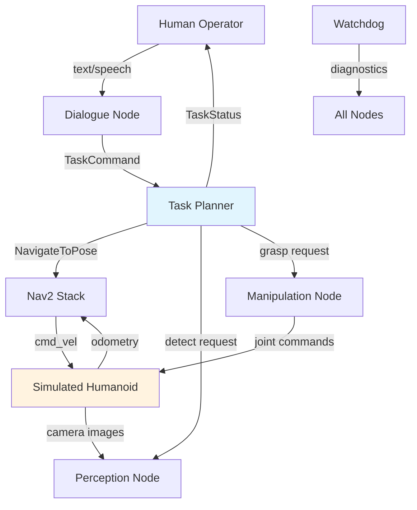

# Implementation Guide

This guide walks you through the complete implementation of the capstone project, from setting up your workspace to running end-to-end scenario tests. Follow the phases in order -- each builds on the previous one.

## Phase 1: Workspace Setup

### 1.1 Create the ROS 2 Workspace

Start by scaffolding your workspace and creating all the required packages.

```bash
# Create the workspace
mkdir -p ~/capstone_ws/src
cd ~/capstone_ws/src

# Create all packages
ros2 pkg create --build-type ament_python humanoid_bringup \
  --description "Launch files and configuration for the humanoid assistant"

ros2 pkg create --build-type ament_python humanoid_perception \
  --description "Object detection and recognition pipeline"

ros2 pkg create --build-type ament_python humanoid_navigation \
  --description "Navigation and path planning for the humanoid"

ros2 pkg create --build-type ament_python humanoid_manipulation \
  --description "Grasp planning and execution"

ros2 pkg create --build-type ament_python humanoid_planning \
  --description "High-level task decomposition and execution"

ros2 pkg create --build-type ament_python humanoid_dialogue \
  --description "Natural language command parsing and response"

ros2 pkg create --build-type ament_cmake humanoid_msgs \
  --description "Custom messages and services"
```

### 1.2 Define Custom Messages

Create the message definitions that all packages will share.

```bash
# TaskCommand.msg
cd ~/capstone_ws/src/humanoid_msgs
mkdir -p msg srv
```

**`msg/TaskCommand.msg`:**
```
# A structured command parsed from natural language
string action           # fetch, inspect, place
string target_object    # object name to interact with
string source_location  # where the object currently is
string destination      # where to deliver (empty if N/A)
float64 confidence      # parser confidence score 0.0 - 1.0
```

**`msg/TaskStatus.msg`:**
```
# Status of a currently executing task
uint8 STATUS_PENDING=0
uint8 STATUS_RUNNING=1
uint8 STATUS_SUCCESS=2
uint8 STATUS_FAILURE=3

uint32 task_id
string task_description
uint8 status
string current_action        # what the robot is doing right now
float32 progress_percent     # 0.0 to 100.0
string details               # human-readable status message
```

**`srv/ParseCommand.srv`:**
```
# Request: raw text command
string raw_command
---
# Response: structured command
humanoid_msgs/TaskCommand command
bool success
string error_message
```

Update `CMakeLists.txt` to build the messages:

```cmake
# In humanoid_msgs/CMakeLists.txt
find_package(rosidl_default_generators REQUIRED)

rosidl_generate_interfaces(${PROJECT_NAME}
  "msg/TaskCommand.msg"
  "msg/TaskStatus.msg"
  "srv/ParseCommand.srv"
)

ament_export_dependencies(rosidl_default_runtime)
```

### 1.3 Build and Verify

```bash
cd ~/capstone_ws
colcon build --symlink-install
source install/setup.bash

# Verify messages are available
ros2 interface show humanoid_msgs/msg/TaskCommand
ros2 interface show humanoid_msgs/msg/TaskStatus
ros2 interface show humanoid_msgs/srv/ParseCommand
```

## Phase 2: Simulation Environment

### 2.1 Create the Apartment World

Design a Gazebo simulation world that represents a multi-room apartment. Place furniture and objects that the robot will interact with.

```xml
<!-- worlds/apartment.sdf (simplified excerpt) -->
<?xml version="1.0" ?>
<sdf version="1.9">
  <world name="apartment">
    
    <!-- Lighting -->
    <light type="directional" name="sun">
      <cast_shadows>true</cast_shadows>
      <pose>0 0 10 0 0 0</pose>
      <diffuse>0.8 0.8 0.8 1</diffuse>
      <specular>0.2 0.2 0.2 1</specular>
      <direction>-0.5 0.1 -0.9</direction>
    </light>

    <!-- Ground Plane -->
    <model name="ground_plane">
      <static>true</static>
      <link name="link">
        <collision name="collision">
          <geometry><plane><normal>0 0 1</normal></plane></geometry>
        </collision>
        <visual name="visual">
          <geometry><plane><normal>0 0 1</normal><size>20 20</size></plane></geometry>
          <material>
            <ambient>0.8 0.8 0.8 1</ambient>
          </material>
        </visual>
      </link>
    </model>

    <!-- Kitchen Area -->
    <model name="kitchen_counter">
      <static>true</static>
      <pose>3.0 2.0 0.45 0 0 0</pose>
      <link name="link">
        <collision name="collision">
          <geometry><box><size>1.5 0.6 0.9</size></box></geometry>
        </collision>
        <visual name="visual">
          <geometry><box><size>1.5 0.6 0.9</size></box></geometry>
          <material>
            <ambient>0.6 0.4 0.2 1</ambient>
          </material>
        </visual>
      </link>
    </model>

    <!-- Red Cup on Kitchen Counter -->
    <model name="red_cup">
      <pose>3.0 2.0 0.95 0 0 0</pose>
      <link name="link">
        <inertial>
          <mass>0.15</mass>
        </inertial>
        <collision name="collision">
          <geometry><cylinder><radius>0.04</radius><length>0.12</length></cylinder></geometry>
        </collision>
        <visual name="visual">
          <geometry><cylinder><radius>0.04</radius><length>0.12</length></cylinder></geometry>
          <material>
            <ambient>0.9 0.1 0.1 1</ambient>
          </material>
        </visual>
      </link>
    </model>

    <!-- Living Room Table -->
    <model name="living_room_table">
      <static>true</static>
      <pose>0.0 0.0 0.35 0 0 0</pose>
      <link name="link">
        <collision name="collision">
          <geometry><box><size>1.2 0.8 0.7</size></box></geometry>
        </collision>
        <visual name="visual">
          <geometry><box><size>1.2 0.8 0.7</size></box></geometry>
          <material>
            <ambient>0.5 0.3 0.15 1</ambient>
          </material>
        </visual>
      </link>
    </model>

  </world>
</sdf>
```

### 2.2 Launch the Simulation

Create a launch file that brings up Gazebo with the apartment world and spawns your humanoid robot.

```python
# humanoid_bringup/launch/simulation.launch.py
import os
from launch import LaunchDescription
from launch.actions import IncludeLaunchDescription, DeclareLaunchArgument
from launch.launch_description_sources import PythonLaunchDescriptionSource
from launch.substitutions import LaunchConfiguration, PathJoinSubstitution
from launch_ros.substitutions import FindPackageShare
from launch_ros.actions import Node

def generate_launch_description():
    pkg_share = FindPackageShare('humanoid_bringup')
    
    # Declare arguments
    use_sim_time = DeclareLaunchArgument(
        'use_sim_time', default_value='true',
        description='Use simulation clock'
    )
    
    world_file = DeclareLaunchArgument(
        'world', 
        default_value=PathJoinSubstitution([pkg_share, 'worlds', 'apartment.sdf']),
        description='Path to the Gazebo world file'
    )
    
    # Launch Gazebo
    gazebo = IncludeLaunchDescription(
        PythonLaunchDescriptionSource([
            PathJoinSubstitution([
                FindPackageShare('ros_gz_sim'), 'launch', 'gz_sim.launch.py'
            ])
        ]),
        launch_arguments={
            'gz_args': ['-r ', LaunchConfiguration('world')],
        }.items()
    )
    
    # Spawn the humanoid robot
    spawn_robot = Node(
        package='ros_gz_sim',
        executable='create',
        arguments=[
            '-name', 'humanoid',
            '-topic', 'robot_description',
            '-x', '0.0', '-y', '0.0', '-z', '0.5'
        ],
        output='screen'
    )
    
    # Robot state publisher
    robot_state_publisher = Node(
        package='robot_state_publisher',
        executable='robot_state_publisher',
        parameters=[{
            'use_sim_time': LaunchConfiguration('use_sim_time'),
        }],
        output='screen'
    )
    
    return LaunchDescription([
        use_sim_time,
        world_file,
        gazebo,
        robot_state_publisher,
        spawn_robot,
    ])
```

### 2.3 Verify the Simulation

```bash
# Build and launch
cd ~/capstone_ws
colcon build --symlink-install
source install/setup.bash

# Launch the simulation
ros2 launch humanoid_bringup simulation.launch.py

# In another terminal, check that topics are available
ros2 topic list
ros2 topic echo /clock  # Should show simulation time
```

## Phase 3: Core Subsystems

### 3.1 Perception Pipeline

Implement the object detection node. For the capstone, you can use either NVIDIA Isaac ROS or a simulated detection pipeline.

```python
# humanoid_perception/humanoid_perception/object_detector.py
import rclpy
from rclpy.node import Node
from sensor_msgs.msg import Image, CameraInfo
from vision_msgs.msg import Detection2DArray, Detection2D, ObjectHypothesisWithPose
from geometry_msgs.msg import PoseStamped
from cv_bridge import CvBridge
import numpy as np


class ObjectDetectorNode(Node):
    """Detects and localizes objects using camera input."""
    
    def __init__(self):
        super().__init__('object_detector')
        
        # Parameters
        self.declare_parameter('confidence_threshold', 0.7)
        self.declare_parameter('model_path', '')
        self.confidence_threshold = self.get_parameter(
            'confidence_threshold').value
        
        # Subscribers
        self.color_sub = self.create_subscription(
            Image, '/camera/color/image_raw', 
            self.color_callback, 10)
        self.depth_sub = self.create_subscription(
            Image, '/camera/depth/image_raw', 
            self.depth_callback, 10)
        self.camera_info_sub = self.create_subscription(
            CameraInfo, '/camera/camera_info', 
            self.camera_info_callback, 10)
        
        # Publishers
        self.detection_pub = self.create_publisher(
            Detection2DArray, '/detections', 10)
        self.object_pose_pub = self.create_publisher(
            PoseStamped, '/detected_object_pose', 10)
        
        # State
        self.bridge = CvBridge()
        self.latest_depth = None
        self.camera_info = None
        
        self.get_logger().info('Object detector initialized')
    
    def camera_info_callback(self, msg: CameraInfo):
        """Store camera intrinsics for 3D projection."""
        self.camera_info = msg
    
    def depth_callback(self, msg: Image):
        """Store latest depth image."""
        self.latest_depth = self.bridge.imgmsg_to_cv2(msg)
    
    def color_callback(self, msg: Image):
        """Run detection on each color frame."""
        cv_image = self.bridge.imgmsg_to_cv2(msg, 'bgr8')
        
        # Run your detection model here
        detections = self.detect_objects(cv_image)
        
        # Convert to ROS message
        det_array = Detection2DArray()
        det_array.header = msg.header
        
        for det in detections:
            if det['confidence'] >= self.confidence_threshold:
                d2d = Detection2D()
                d2d.bbox.center.position.x = float(det['cx'])
                d2d.bbox.center.position.y = float(det['cy'])
                d2d.bbox.size_x = float(det['width'])
                d2d.bbox.size_y = float(det['height'])
                
                hyp = ObjectHypothesisWithPose()
                hyp.hypothesis.class_id = det['class']
                hyp.hypothesis.score = det['confidence']
                d2d.results.append(hyp)
                
                det_array.detections.append(d2d)
                
                # Compute 3D pose if depth is available
                if self.latest_depth is not None and self.camera_info:
                    pose = self.project_to_3d(
                        det['cx'], det['cy'], self.latest_depth)
                    if pose:
                        self.object_pose_pub.publish(pose)
        
        self.detection_pub.publish(det_array)
    
    def detect_objects(self, image: np.ndarray) -> list:
        """
        Run object detection on the input image.
        Replace this with your actual model inference.
        """
        # Placeholder: integrate your model here
        # For Isaac ROS, use the DNN inference node pipeline
        return []
    
    def project_to_3d(self, u: float, v: float, 
                       depth_image: np.ndarray) -> PoseStamped:
        """Project a 2D pixel coordinate to 3D using the depth image."""
        if self.camera_info is None:
            return None
        
        # Get depth at pixel
        depth = depth_image[int(v), int(u)]
        if depth <= 0 or np.isnan(depth):
            return None
        
        # Camera intrinsics
        fx = self.camera_info.k[0]
        fy = self.camera_info.k[4]
        cx = self.camera_info.k[2]
        cy = self.camera_info.k[5]
        
        # Back-project to 3D
        x = (u - cx) * depth / fx
        y = (v - cy) * depth / fy
        z = depth
        
        pose = PoseStamped()
        pose.header.frame_id = self.camera_info.header.frame_id
        pose.header.stamp = self.get_clock().now().to_msg()
        pose.pose.position.x = x
        pose.pose.position.y = y
        pose.pose.position.z = z
        pose.pose.orientation.w = 1.0
        
        return pose


def main(args=None):
    rclpy.init(args=args)
    node = ObjectDetectorNode()
    rclpy.spin(node)
    node.destroy_node()
    rclpy.shutdown()


if __name__ == '__main__':
    main()
```

### 3.2 Navigation Stack

Configure Nav2 for your humanoid. Create a parameter file tailored to indoor navigation.

```yaml
# humanoid_bringup/config/nav2_params.yaml
bt_navigator:
  ros__parameters:
    use_sim_time: true
    global_frame: map
    robot_base_frame: base_link
    odom_topic: /odom
    bt_loop_duration: 10
    default_server_timeout: 20
    navigators: ["navigate_to_pose"]
    navigate_to_pose:
      plugin: "nav2_bt_navigator/NavigateToPoseNavigator"

controller_server:
  ros__parameters:
    use_sim_time: true
    controller_frequency: 20.0
    min_x_velocity_threshold: 0.001
    min_y_velocity_threshold: 0.001
    min_theta_velocity_threshold: 0.001
    progress_checker_plugins: ["progress_checker"]
    goal_checker_plugins: ["general_goal_checker"]
    controller_plugins: ["FollowPath"]

    progress_checker:
      plugin: "nav2_controller::SimpleProgressChecker"
      required_movement_radius: 0.5
      movement_time_allowance: 10.0

    general_goal_checker:
      plugin: "nav2_controller::SimpleGoalChecker"
      xy_goal_tolerance: 0.25
      yaw_goal_tolerance: 0.25

    FollowPath:
      plugin: "dwb_core::DWBLocalPlanner"
      max_vel_x: 0.5
      min_vel_x: 0.0
      max_vel_y: 0.0
      max_vel_theta: 1.0
      min_speed_xy: 0.0
      max_speed_xy: 0.5
      min_speed_theta: 0.0
      acc_lim_x: 2.5
      acc_lim_y: 0.0
      acc_lim_theta: 3.2
      decel_lim_x: -2.5
      decel_lim_y: 0.0
      decel_lim_theta: -3.2

planner_server:
  ros__parameters:
    use_sim_time: true
    planner_plugins: ["GridBased"]
    GridBased:
      plugin: "nav2_navfn_planner/NavfnPlanner"
      tolerance: 0.5
      use_astar: true
      allow_unknown: true

local_costmap:
  local_costmap:
    ros__parameters:
      update_frequency: 5.0
      publish_frequency: 2.0
      global_frame: odom
      robot_base_frame: base_link
      rolling_window: true
      width: 3
      height: 3
      resolution: 0.05

global_costmap:
  global_costmap:
    ros__parameters:
      update_frequency: 1.0
      publish_frequency: 1.0
      global_frame: map
      robot_base_frame: base_link
      resolution: 0.05
      track_unknown_space: true
```

### 3.3 Task Planner Node

Implement the central planner that coordinates all subsystems.

```python
# humanoid_planning/humanoid_planning/task_planner.py
import rclpy
from rclpy.node import Node
from rclpy.action import ActionClient
from humanoid_msgs.msg import TaskCommand, TaskStatus
from humanoid_msgs.srv import ParseCommand
from nav2_msgs.action import NavigateToPose
from geometry_msgs.msg import PoseStamped
from enum import Enum
from typing import Optional


class PlannerState(Enum):
    IDLE = "idle"
    PARSING = "parsing"
    NAVIGATING = "navigating"
    DETECTING = "detecting"
    GRASPING = "grasping"
    PLACING = "placing"
    REPORTING = "reporting"


class TaskPlannerNode(Node):
    """Orchestrates task execution by coordinating all subsystems."""
    
    def __init__(self):
        super().__init__('task_planner')
        
        # State
        self.state = PlannerState.IDLE
        self.current_task_id = 0
        
        # Known locations (x, y, yaw)
        self.locations = {
            'kitchen_counter': (3.0, 2.5, 0.0),
            'living_room_table': (0.0, 0.0, 0.0),
            'bedroom_window': (-2.0, 4.0, 1.57),
            'bookshelf': (1.0, -1.5, 3.14),
            'user': (0.0, -1.0, 0.0),
        }
        
        # Subscribers
        self.command_sub = self.create_subscription(
            TaskCommand, '/task_command', 
            self.command_callback, 10)
        
        # Publishers
        self.status_pub = self.create_publisher(
            TaskStatus, '/task_status', 10)
        
        # Action clients
        self.nav_client = ActionClient(
            self, NavigateToPose, 'navigate_to_pose')
        
        # Service clients
        self.parse_client = self.create_client(
            ParseCommand, '/parse_command')
        
        self.get_logger().info('Task planner ready')
    
    def command_callback(self, msg: TaskCommand):
        """Handle incoming task commands."""
        if self.state != PlannerState.IDLE:
            self.get_logger().warn(
                'Received command while busy. Queueing not yet implemented.')
            return
        
        self.current_task_id += 1
        self.get_logger().info(
            f'Task {self.current_task_id}: {msg.action} '
            f'{msg.target_object} from {msg.source_location}')
        
        # Dispatch based on action type
        if msg.action == 'fetch':
            self.execute_fetch(msg)
        elif msg.action == 'inspect':
            self.execute_inspect(msg)
        elif msg.action == 'place':
            self.execute_place(msg)
        else:
            self.publish_status(
                TaskStatus.STATUS_FAILURE,
                f'Unknown action: {msg.action}')
    
    def execute_fetch(self, cmd: TaskCommand):
        """Execute a fetch task: navigate, detect, grasp, deliver."""
        steps = [
            ('navigating', f'Navigating to {cmd.source_location}'),
            ('detecting', f'Detecting {cmd.target_object}'),
            ('grasping', f'Grasping {cmd.target_object}'),
            ('navigating', f'Returning to {cmd.destination or "user"}'),
            ('placing', f'Delivering {cmd.target_object}'),
        ]
        
        for i, (state, description) in enumerate(steps):
            progress = (i / len(steps)) * 100.0
            self.publish_status(
                TaskStatus.STATUS_RUNNING, description, progress)
            
            # Execute each step
            success = self.execute_step(state, cmd, step_index=i)
            if not success:
                self.publish_status(
                    TaskStatus.STATUS_FAILURE,
                    f'Failed at: {description}')
                return
        
        self.publish_status(
            TaskStatus.STATUS_SUCCESS,
            f'Successfully delivered {cmd.target_object}', 100.0)
    
    def execute_inspect(self, cmd: TaskCommand):
        """Execute an inspect task: navigate, detect, report."""
        self.publish_status(
            TaskStatus.STATUS_RUNNING,
            f'Navigating to {cmd.source_location}', 0.0)
        
        nav_success = self.navigate_to(cmd.source_location)
        if not nav_success:
            self.publish_status(
                TaskStatus.STATUS_FAILURE,
                f'Could not reach {cmd.source_location}')
            return
        
        self.publish_status(
            TaskStatus.STATUS_RUNNING,
            f'Inspecting {cmd.target_object}', 50.0)
        
        # Detection and analysis happens here
        
        self.publish_status(
            TaskStatus.STATUS_SUCCESS,
            f'Inspection of {cmd.target_object} complete', 100.0)
    
    def execute_place(self, cmd: TaskCommand):
        """Execute a place task: navigate to source, grasp, navigate to dest, place."""
        self.execute_fetch(cmd)  # Same flow as fetch
    
    def execute_step(self, state: str, cmd: TaskCommand, 
                      step_index: int) -> bool:
        """Execute a single step of a task plan."""
        if state == 'navigating':
            if step_index == 0:
                return self.navigate_to(cmd.source_location)
            else:
                dest = cmd.destination or 'user'
                return self.navigate_to(dest)
        elif state == 'detecting':
            return self.detect_object(cmd.target_object)
        elif state == 'grasping':
            return self.grasp_object(cmd.target_object)
        elif state == 'placing':
            return self.place_object(cmd.target_object)
        return False
    
    def navigate_to(self, location: str) -> bool:
        """Send a navigation goal and wait for result."""
        if location not in self.locations:
            self.get_logger().error(f'Unknown location: {location}')
            return False
        
        x, y, yaw = self.locations[location]
        
        goal = NavigateToPose.Goal()
        goal.pose = PoseStamped()
        goal.pose.header.frame_id = 'map'
        goal.pose.header.stamp = self.get_clock().now().to_msg()
        goal.pose.pose.position.x = x
        goal.pose.pose.position.y = y
        goal.pose.pose.orientation.z = yaw
        goal.pose.pose.orientation.w = 1.0
        
        self.nav_client.wait_for_server()
        future = self.nav_client.send_goal_async(goal)
        rclpy.spin_until_future_complete(self, future)
        
        goal_handle = future.result()
        if not goal_handle.accepted:
            return False
        
        result_future = goal_handle.get_result_async()
        rclpy.spin_until_future_complete(self, result_future)
        
        return True
    
    def detect_object(self, object_name: str) -> bool:
        """Attempt to detect the target object."""
        self.get_logger().info(f'Detecting: {object_name}')
        # Integration point: subscribe to /detections and search
        return True  # Placeholder
    
    def grasp_object(self, object_name: str) -> bool:
        """Attempt to grasp the target object."""
        self.get_logger().info(f'Grasping: {object_name}')
        # Integration point: call MoveIt2 grasp action
        return True  # Placeholder
    
    def place_object(self, object_name: str) -> bool:
        """Place the currently held object."""
        self.get_logger().info(f'Placing: {object_name}')
        # Integration point: call MoveIt2 place action
        return True  # Placeholder
    
    def publish_status(self, status: int, details: str, 
                        progress: float = 0.0):
        """Publish task status update."""
        msg = TaskStatus()
        msg.task_id = self.current_task_id
        msg.status = status
        msg.details = details
        msg.progress_percent = progress
        self.status_pub.publish(msg)
        self.get_logger().info(f'[Task {self.current_task_id}] {details}')


def main(args=None):
    rclpy.init(args=args)
    node = TaskPlannerNode()
    rclpy.spin(node)
    node.destroy_node()
    rclpy.shutdown()


if __name__ == '__main__':
    main()
```

## Phase 4: Full System Launch

### 4.1 Complete Launch File

Create a launch file that brings up every component.

```python
# humanoid_bringup/launch/full_system.launch.py
import os
from launch import LaunchDescription
from launch.actions import IncludeLaunchDescription, DeclareLaunchArgument
from launch.launch_description_sources import PythonLaunchDescriptionSource
from launch.substitutions import LaunchConfiguration, PathJoinSubstitution
from launch_ros.substitutions import FindPackageShare
from launch_ros.actions import Node

def generate_launch_description():
    pkg_share = FindPackageShare('humanoid_bringup')
    use_sim_time = LaunchConfiguration('use_sim_time', default='true')
    
    # Include simulation launch
    simulation = IncludeLaunchDescription(
        PythonLaunchDescriptionSource([
            PathJoinSubstitution([pkg_share, 'launch', 'simulation.launch.py'])
        ])
    )
    
    # Nav2 Navigation Stack
    nav2_params = PathJoinSubstitution([pkg_share, 'config', 'nav2_params.yaml'])
    navigation = IncludeLaunchDescription(
        PythonLaunchDescriptionSource([
            PathJoinSubstitution([
                FindPackageShare('nav2_bringup'), 'launch', 'bringup_launch.py'
            ])
        ]),
        launch_arguments={
            'use_sim_time': 'true',
            'params_file': nav2_params,
        }.items()
    )
    
    # Perception node
    perception = Node(
        package='humanoid_perception',
        executable='object_detector',
        name='object_detector',
        parameters=[{'use_sim_time': use_sim_time}],
        output='screen'
    )
    
    # Task planner node
    planner = Node(
        package='humanoid_planning',
        executable='task_planner',
        name='task_planner',
        parameters=[{'use_sim_time': use_sim_time}],
        output='screen'
    )
    
    # Dialogue node
    dialogue = Node(
        package='humanoid_dialogue',
        executable='command_parser',
        name='command_parser',
        parameters=[{'use_sim_time': use_sim_time}],
        output='screen'
    )
    
    # System health watchdog
    watchdog = Node(
        package='humanoid_bringup',
        executable='watchdog',
        name='system_watchdog',
        parameters=[{
            'use_sim_time': use_sim_time,
            'check_interval': 5.0,
            'node_timeout': 10.0,
        }],
        output='screen'
    )
    
    return LaunchDescription([
        DeclareLaunchArgument('use_sim_time', default_value='true'),
        simulation,
        navigation,
        perception,
        planner,
        dialogue,
        watchdog,
    ])
```

### 4.2 System Health Watchdog

Implement a watchdog node that monitors system health.

```python
# humanoid_bringup/humanoid_bringup/watchdog.py
import rclpy
from rclpy.node import Node
from diagnostic_msgs.msg import DiagnosticArray, DiagnosticStatus


class SystemWatchdog(Node):
    """Monitors health of all subsystem nodes."""
    
    REQUIRED_NODES = [
        'object_detector',
        'task_planner',
        'command_parser',
    ]
    
    def __init__(self):
        super().__init__('system_watchdog')
        
        self.declare_parameter('check_interval', 5.0)
        interval = self.get_parameter('check_interval').value
        
        self.diag_pub = self.create_publisher(
            DiagnosticArray, '/diagnostics', 10)
        
        self.timer = self.create_timer(interval, self.check_health)
        self.get_logger().info('System watchdog started')
    
    def check_health(self):
        """Check that all required nodes are alive."""
        node_names = self.get_node_names()
        diag = DiagnosticArray()
        diag.header.stamp = self.get_clock().now().to_msg()
        
        all_healthy = True
        for required in self.REQUIRED_NODES:
            status = DiagnosticStatus()
            status.name = required
            
            if required in node_names:
                status.level = DiagnosticStatus.OK
                status.message = 'Node is running'
            else:
                status.level = DiagnosticStatus.ERROR
                status.message = 'Node is NOT running'
                all_healthy = False
                self.get_logger().error(f'Missing node: {required}')
            
            diag.status.append(status)
        
        self.diag_pub.publish(diag)
        
        if all_healthy:
            self.get_logger().debug('All nodes healthy')


def main(args=None):
    rclpy.init(args=args)
    node = SystemWatchdog()
    rclpy.spin(node)
    node.destroy_node()
    rclpy.shutdown()


if __name__ == '__main__':
    main()
```

## Phase 5: Testing

### 5.1 Unit Test Example

```python
# humanoid_planning/test/test_task_planner.py
import unittest
from humanoid_msgs.msg import TaskCommand


class TestTaskDecomposition(unittest.TestCase):
    """Test that commands are decomposed into correct action sequences."""
    
    def test_fetch_command_creates_five_steps(self):
        """A fetch command should decompose into 5 primitive actions."""
        cmd = TaskCommand()
        cmd.action = 'fetch'
        cmd.target_object = 'red cup'
        cmd.source_location = 'kitchen_counter'
        cmd.destination = 'user'
        
        # The planner should produce: navigate, detect, grasp, navigate, place
        expected_steps = ['navigating', 'detecting', 'grasping', 
                         'navigating', 'placing']
        self.assertEqual(len(expected_steps), 5)
    
    def test_inspect_command_creates_three_steps(self):
        """An inspect command should decompose into 3 primitive actions."""
        cmd = TaskCommand()
        cmd.action = 'inspect'
        cmd.target_object = 'window'
        cmd.source_location = 'bedroom_window'
        
        expected_steps = ['navigating', 'detecting', 'reporting']
        self.assertEqual(len(expected_steps), 3)
    
    def test_unknown_action_rejected(self):
        """Unknown actions should be rejected gracefully."""
        cmd = TaskCommand()
        cmd.action = 'dance'
        cmd.target_object = 'robot'
        cmd.source_location = 'living_room'
        
        # The planner should report failure for unknown actions
        self.assertNotIn(cmd.action, ['fetch', 'inspect', 'place'])
    
    def test_unknown_location_rejected(self):
        """Commands referencing unknown locations should fail."""
        known_locations = [
            'kitchen_counter', 'living_room_table', 
            'bedroom_window', 'bookshelf', 'user'
        ]
        self.assertNotIn('garage', known_locations)


class TestCommandValidation(unittest.TestCase):
    """Test command validation logic."""
    
    def test_valid_command(self):
        """A command with all required fields is valid."""
        cmd = TaskCommand()
        cmd.action = 'fetch'
        cmd.target_object = 'book'
        cmd.source_location = 'living_room_table'
        
        self.assertTrue(
            bool(cmd.action and cmd.target_object and cmd.source_location))
    
    def test_missing_action_invalid(self):
        """A command without an action is invalid."""
        cmd = TaskCommand()
        cmd.action = ''
        cmd.target_object = 'book'
        cmd.source_location = 'table'
        
        self.assertFalse(
            bool(cmd.action and cmd.target_object and cmd.source_location))
    
    def test_missing_object_invalid(self):
        """A command without a target object is invalid."""
        cmd = TaskCommand()
        cmd.action = 'fetch'
        cmd.target_object = ''
        cmd.source_location = 'table'
        
        self.assertFalse(
            bool(cmd.action and cmd.target_object and cmd.source_location))


if __name__ == '__main__':
    unittest.main()
```

### 5.2 Integration Test Example

```python
# humanoid_bringup/test/test_system_integration.py
import unittest
import rclpy
from rclpy.node import Node
from humanoid_msgs.msg import TaskCommand, TaskStatus


class TestSystemIntegration(unittest.TestCase):
    """Integration tests that verify cross-node communication."""
    
    @classmethod
    def setUpClass(cls):
        rclpy.init()
    
    @classmethod
    def tearDownClass(cls):
        rclpy.shutdown()
    
    def test_command_publishes_status(self):
        """Publishing a command should eventually produce a status update."""
        node = rclpy.create_node('test_integration')
        
        received_status = []
        
        cmd_pub = node.create_publisher(TaskCommand, '/task_command', 10)
        status_sub = node.create_subscription(
            TaskStatus, '/task_status',
            lambda msg: received_status.append(msg), 10)
        
        # Publish a command
        cmd = TaskCommand()
        cmd.action = 'inspect'
        cmd.target_object = 'window'
        cmd.source_location = 'bedroom_window'
        
        # Allow time for nodes to connect
        import time
        time.sleep(1.0)
        cmd_pub.publish(cmd)
        
        # Spin for a few seconds to receive status
        end_time = time.time() + 5.0
        while time.time() < end_time and len(received_status) == 0:
            rclpy.spin_once(node, timeout_sec=0.1)
        
        node.destroy_node()
        
        # Verify we received at least one status update
        self.assertGreater(len(received_status), 0,
                          'No task status received after publishing command')


if __name__ == '__main__':
    unittest.main()
```

### 5.3 Running All Tests

```bash
cd ~/capstone_ws

# Build everything
colcon build --symlink-install

# Run all tests
colcon test

# View test results
colcon test-result --verbose

# Run linting
pip install flake8
flake8 src/ --max-line-length 100 --exclude __pycache__
```

## Phase 6: Documentation

### 6.1 Architecture Diagram

Include a system architecture diagram in your report. Use Mermaid for easy rendering:



### 6.2 Report Outline

Your final report should follow this structure:

1. **Abstract** (200 words)
2. **Introduction** -- problem statement and objectives
3. **System Architecture** -- high-level design and node graph
4. **Implementation** -- per-subsystem description with key design decisions
5. **Testing and Results** -- test methodology, metrics, success rates
6. **Discussion** -- what worked, what did not, trade-offs encountered
7. **Conclusion and Future Work**
8. **References**
9. **Appendix** -- full configuration files, additional diagrams

## Tips for Success

:::tip Architecture First
Spend Week 13 on architecture. A solid design document prevents painful rewrites in Week 15. Review the design with your instructor mentor before coding.
:::

:::tip Incremental Integration
Do not build all subsystems separately and integrate at the end. Integrate one subsystem at a time, starting with navigation. Each integration should be tested before adding the next.
:::

:::tip Version Control Discipline
Commit frequently with meaningful messages. Use feature branches and merge via pull requests. Your Git history is part of the evaluation.
:::

:::caution Common Pitfalls
- **Over-scoping**: Focus on the three required scenarios before adding extras
- **Ignoring simulation performance**: Tune physics step size and sensor rates early
- **Late testing**: Write tests alongside code, not after
- **Poor error handling**: The demo gods are harsh -- handle every failure case
:::

## Next Steps

Return to the [Project Requirements](./project-requirements) to review the evaluation rubric, or visit the [Hardware Guide](/hardware-guide/) to set up your development environment.
